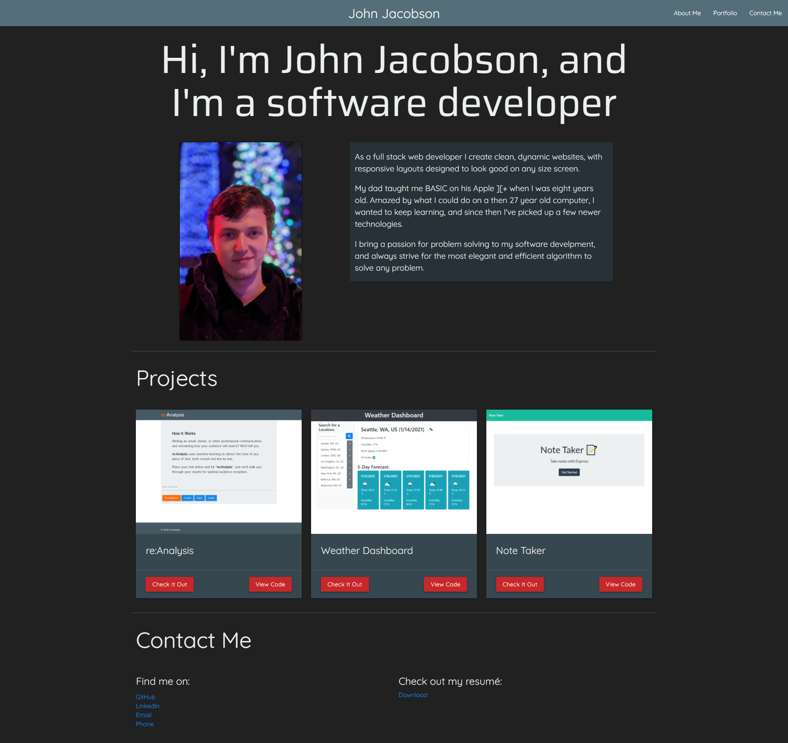

# React Portfolio

## Description

This is my portfolio site, made with React. It has a bio, some examples of my work, and contact information.

Check it out deployed at [johndjake.com](https://johndjake.com).

## Table of Contents

* [Installation](#installation)
* [Usage](#usage)
* [Contributing](#contributing)
* [Tests](#tests)
* [License](#license)
* [Questions](#questions)

## Installation

If you'd like to run the source code yourself, clone this repository, then run `npm install`.

## Usage

Check out my deployed link above!

To run the site yourself from the source code, follow the installation instructions, then run `npm start`.

## Contributing

Feel free to fork/pull if you have suggestions for me.

## Tests

This app has no test code.

## License

[MIT License](https://opensource.org/licenses/MIT)

A short and simple permissive license with conditions only requiring preservation of copyright and license notices. Licensed works, modifications, and larger works may be distributed under different terms and without source code.

## Questions

If you have questions take a look at my GitHub

[JohnDJake](https://github.com/JohnDJake)

Or send me an email

[john.d.jake@gmail.com](mailto:john.d.jake@gmail.com)

